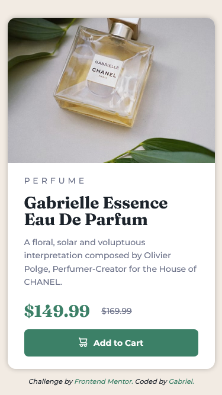

# 💻 Product Preview Component | Frontend Mentor

This is my solution for the [Product Preview Card Component Challenge](https://www.frontendmentor.io/challenges/product-preview-card-component-GO7UmttRfa) from [Frontendmentor.io](https://www.frontendmentor.io/home), made with HTML and plain CSS.

It was a very fun and challenging project, I wanted to put BEM in practice by putting the full names of the classes to really fix this metodology in my head.

I had some difficulties but after reading the documentations from **MDN** and **W3Schools** I managed to finish it on my own. Also, since I'm a free user, I didn't get the Figma file so it adds an extra layer of challenge for the completion.

## 🔨 Technologies

* HTML
* CSS + Custom Properties
* Flexbox and Grid Layout
* BEM
* Mobile First
* Coded with Visual Studio Code

## 🖼️ Screenshots

You can check the project's [repository here](https://github.com/GracilianoOG/fementor-product-card) or the live [preview here](https://gracilianoog.github.io/fementor-product-card/).

### 💻 Desktop Layout

### 📱 Mobile Layout

## 📌 More Info

Challenge from **Frontend Mentor** made by me, based on the design provided.

## 🔗 Links

* [🔍 Frontend Mentor](https://www.frontendmentor.io/home)
* [🔍 Product Preview Challenge](https://www.frontendmentor.io/challenges/product-preview-card-component-GO7UmttRfa)
* [🔍 Heading Tags](https://www.w3schools.com/tags/tag_hn.asp)
* [🔍 Heading Levels - Accessibility](https://dequeuniversity.com/rules/axe/4.3/heading-order?application=axeAPI)
* [🔍 Picture Tag](https://www.w3schools.com/TAGs/tag_picture.asp)
* [🔍 Box Alignment - Flexbox](https://developer.mozilla.org/en-US/docs/Web/CSS/CSS_Box_Alignment/Box_Alignment_in_Flexbox)
* [🔍 Article Tag](https://developer.mozilla.org/en-US/docs/Web/HTML/Element/article)
* [🔍 Section Tag](https://developer.mozilla.org/en-US/docs/Web/HTML/Element/section)
* [🔍 Lang Attribute](https://developer.mozilla.org/pt-BR/docs/Web/HTML/Global_attributes/lang)